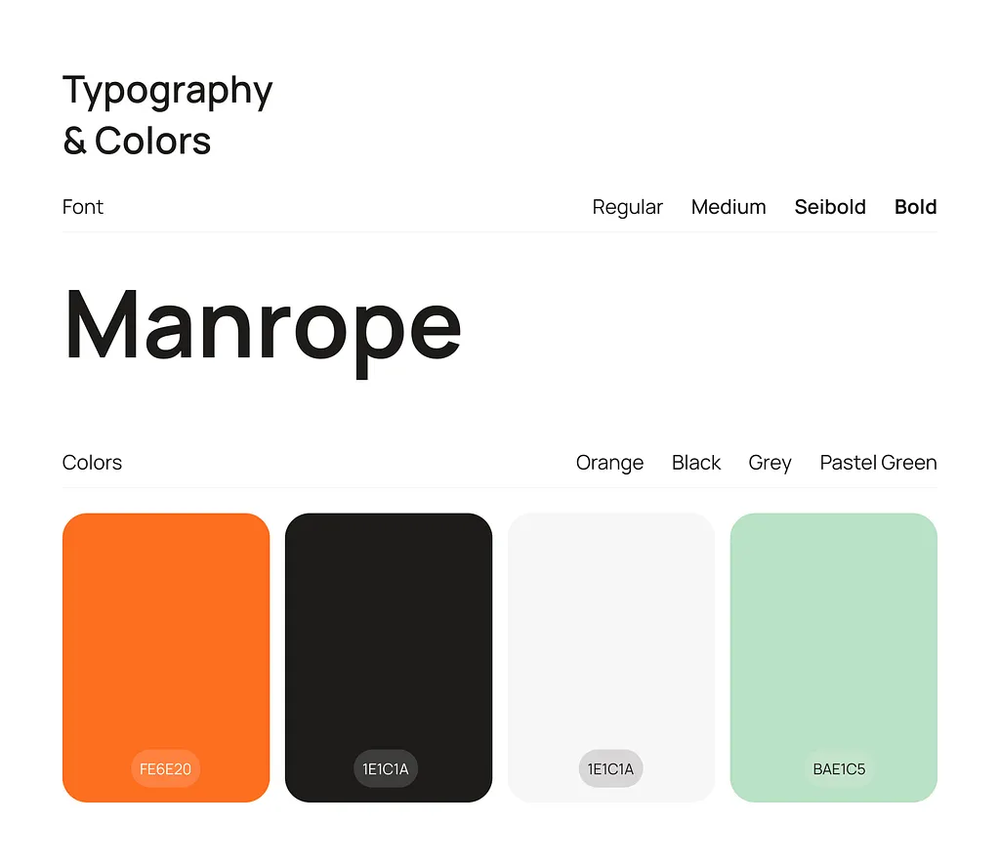
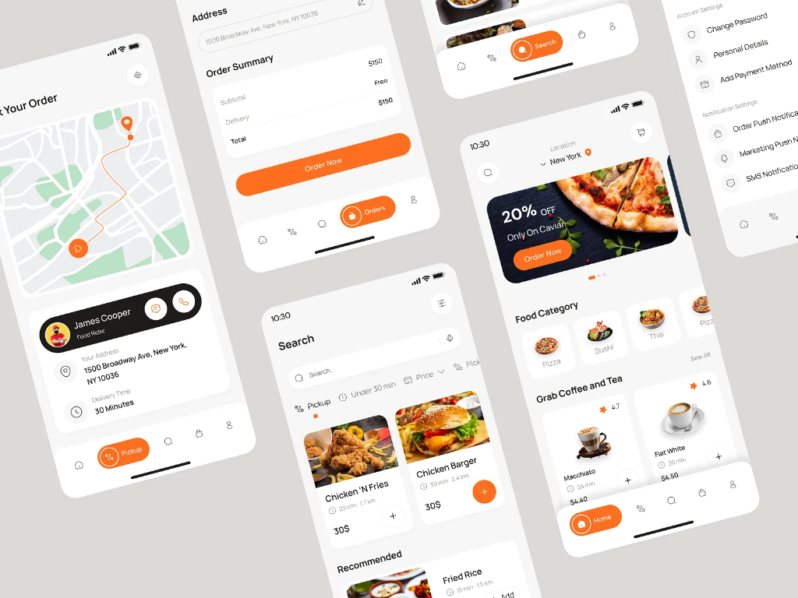
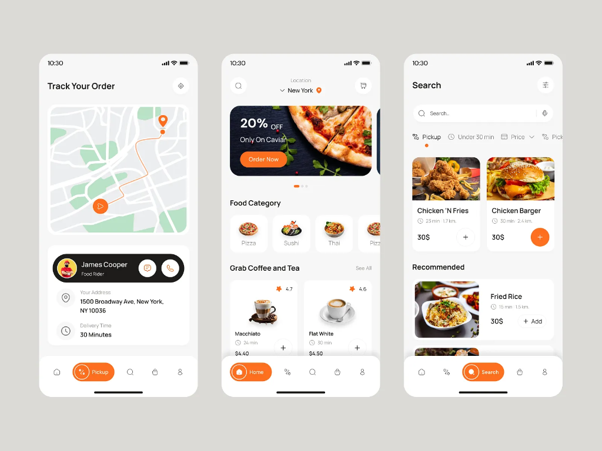
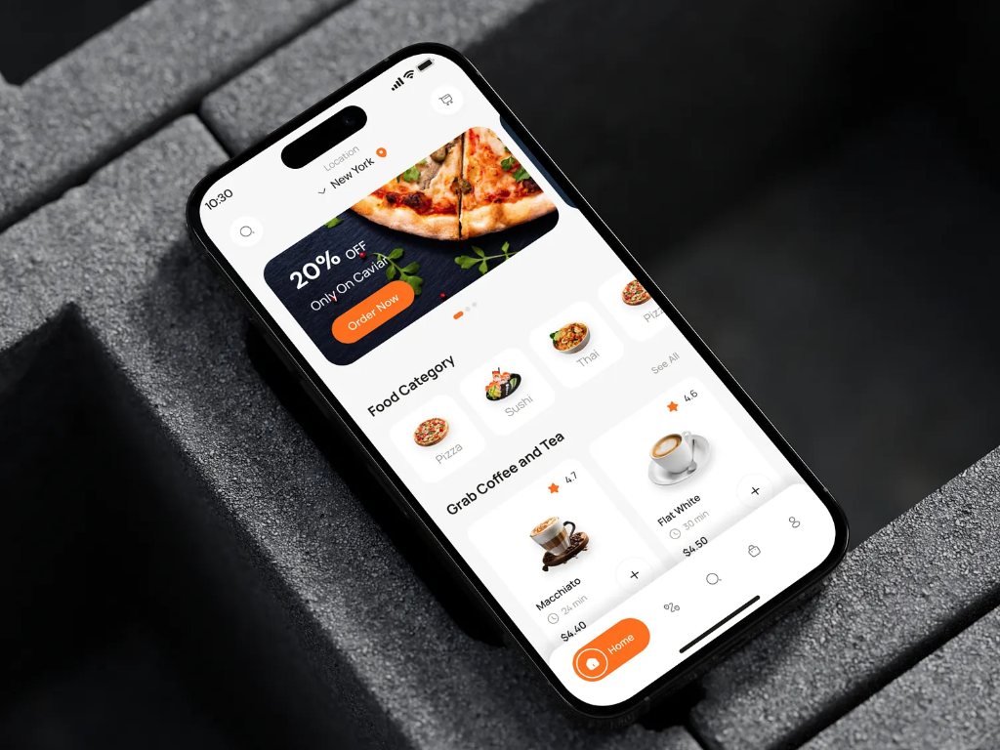
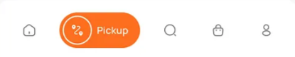
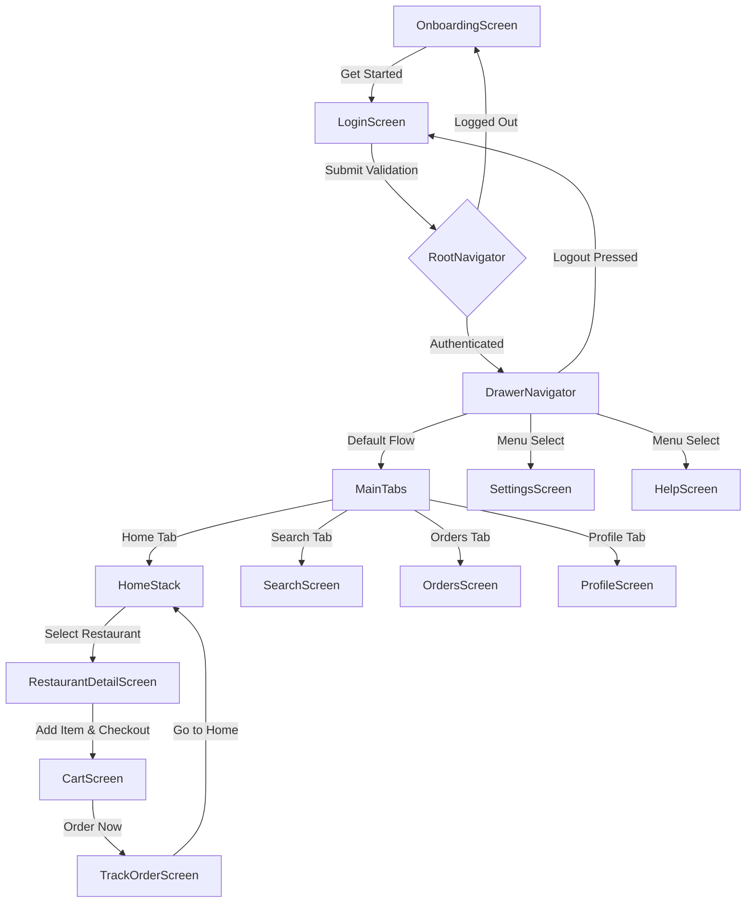

# 🍔 Zaika - Premium Food Delivery App

Zaika is a high-fidelity, premium React Native food delivery application built using **Expo (SDK 54)** and **TypeScript**. The application is designed to demonstrate advanced **React Navigation (v7)** structures, featuring nested navigators, custom bottom tab pills, modal panels, dynamic theme integrations, simulated active state flows, and custom deep linking support.

---

## 📸 Interface Showcases

Here is a look at the custom premium screens built for **Zaika**:

| 📱 Onboarding Screen | 🏠 Home & Featured Feed |
| :---: | :---: |
|  |  |

| 🍜 Restaurant Details & Menus | 🗺️ Live Delivery Path Tracker |
| :---: | :---: |
|  |  |

| 📋 Active & Past Orders List |
| :---: |
|  |

---

## 🛠️ Technology Stack & Core Design System

* **Core Framework:** React Native with Expo SDK 54.0.0
* **Programming Language:** 100% Type-Safe TypeScript
* **Navigation Architecture:** `@react-navigation` suite (v7) including Stack, bottom tabs, custom drawer modules, and deep links.
* **Styling & Theme:** Curated Vanilla React Native Stylesheets utilizing custom HSL palettes:
  * **Primary Accent (Orange):** `#FE6E20` (Zaika Charcoal Branding)
  * **Charcoal Text:** `#1E1C1A`
  * **Light Grey Backgrounds:** `#F4F4F6`
* **Typography:** Integrated Google Fonts (`Manrope_700Bold`, `Manrope_600SemiBold`, `Manrope_500Medium`, and `Manrope_400Regular`) loaded dynamically.
* **Context Modules:** Fully customized `AuthContext` for premium identity handling (`Aria Chen`) and `CartContext` supporting advanced real-time basket calculations.

---

## 🗺️ Navigation Architecture

The visual layout below maps out how the different navigation stacks interact dynamically inside the application:



---

## ⚙️ Advanced Navigation Implementations

1. **Dynamic Safe-Area Insets Bottom Tab:**
   * Utilizes `useSafeAreaInsets()` to compute the tab bar height dynamically (`64 + insets.bottom`) to ensure perfect visual balance on notched devices.
   * Employs absolutely positioned active pill containers and inactive tab icons sharing identical visual centers (`top: "50%", marginTop: -19`), yielding zero-jitter, buttery smooth active tab shifts.
   * Completely hides the bottom tab bar dynamically on deeply nested stacks like `RestaurantDetail`, `Cart`, and `TrackOrder`.
2. **Custom Luxury Notifications/Badges:**
   * Features bespoke, high-contrast, white-bordered notifications on the Orders tab (`activeBadgeContainer` and `inactiveBadgeContainer`) instead of default OS notification containers.
3. **Deep Linking Capability:**
   * Custom configured to handle paths matching the `foodapp://` and `zaika://` schemas, allowing users to deep-link directly into a specific restaurant detail panel:
     `zaika://restaurant/r1`

---

## ⚡ Getting Started

### Prerequisites
Make sure you have [Bun](https://bun.sh/) (or Node.js) installed on your system.

### Installation
1. Clone the repository and navigate to the project directory:
   ```bash
   cd zaika
   ```
2. Install the dependencies:
   ```bash
   bun install
   ```

### Running the App
Start the Metro server with Expo:
```bash
bun expo start
```
* **Android:** Press `a` or scan the Metro QR code inside **Expo Go** on Android.
* **iOS:** Press `i` or scan the QR code with your iOS Camera app inside **Expo Go**.
